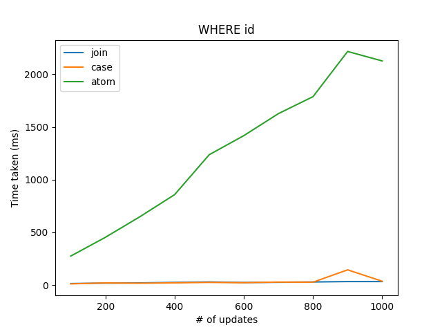
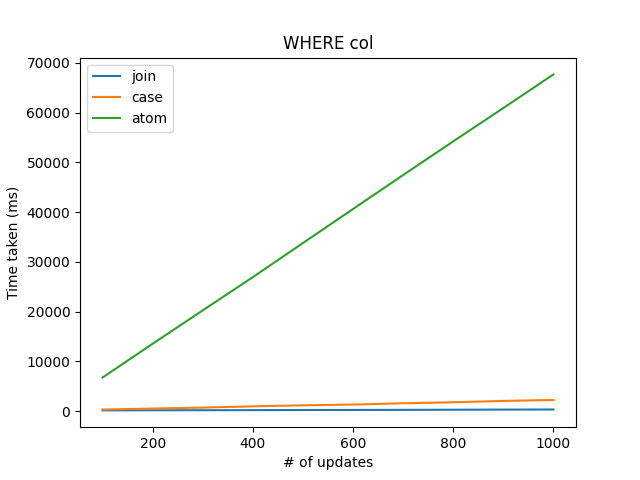
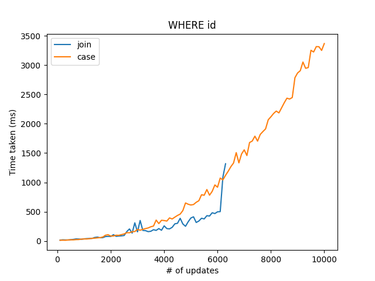
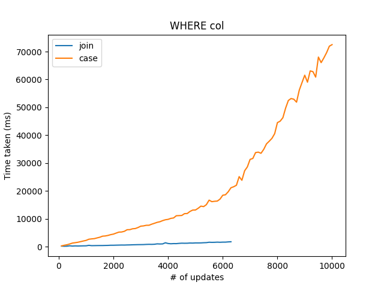

# MySQL 8.0 Bulk Update Benchmark

Just a mini project to benchmark massive UPDATE queries in MySQL 8.0,
based on a few methods available

I've always been curious on how one could perform massive distinct updates
without much performance issues, since it's pretty similar to the N+1 problem
for SELECT query

## To run

```sh
docker compose up
go run . [--id] [--no-atom] [--multiplier MULTIPLIER] [--iter ITER] outputFilename
python plot.py --title TITLE input_file output_file
```

## Results









## Explanation

The test is done by running n number of updates to a huge table,
and measure the time taken to complete the task. It's broken down
to two categories (`WHERE id`, `WHERE col`), in which

* `WHERE id` - includes the primary key as part of the WHERE clause
* `WHERE cols` - contains only non-indexed columns as part of the WHERE clause

The methods used to update the table are as follows:

* atom

  ```sql
  BEGIN TRANSACTION;
  UPDATE tb SET val = 1 WHERE col = 100;
  UPDATE tb SET val = 2 WHERE col = 500;
  COMMIT;
  ```

* case

  ```sql
  UPDATE tb SET val = (
    CASE
      WHEN col = 100 THEN 1
      WHEN col = 500 THEN 2
    END
  ) WHERE col = 100 OR col = 500;
  ```

* join

  ```sql
  UPDATE tb INNER JOIN (
    SELECT 100 col, 1 val UNION ALL
    SELECT 500 col, 2 val
  ) update_tb ON
    tb.col = update_tb.col
  SET tb.val = update_tb.val
  ```

## Conclusion

The end results shows that `join` > `case` >>> `atom` in terms of performance,
with the catch that `join` method will fail if the bulk update gets too huge

## Notes

* `case` method can fail by `max_allowed_packet` if the statement gets too
  lengthy
* `join` method can fail by `max_allowed_packet`, and `Thread stack overrun`
  if it contains too many `UNION ALL`
* There's another method not discussed in this project, which makes use of
  `INSERT INTO ... ON DUPLICATE KEY UPDATE`. It's not included as it apparently
  has some issues in the older versions of MySQL
  ([see](https://stackoverflow.com/questions/35726910/bulk-update-mysql-with-where-statement/#comment124715317_35727615))
